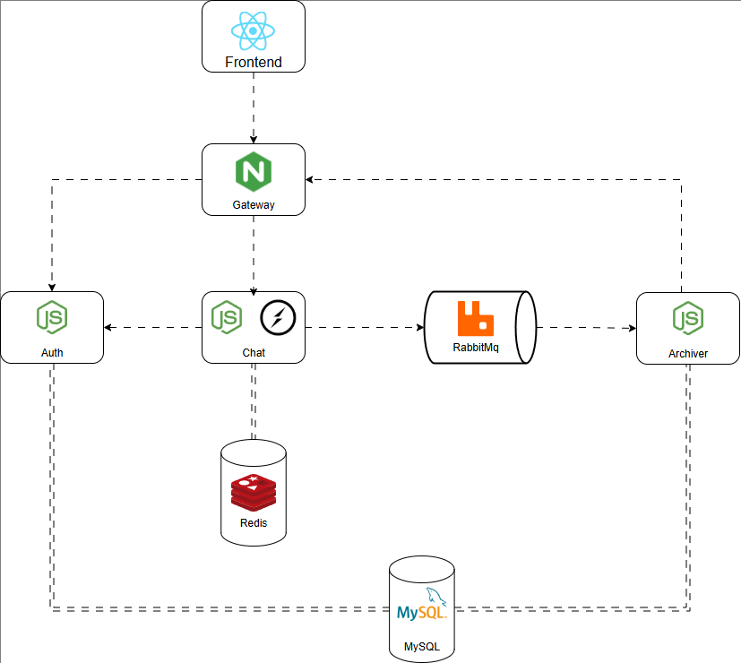

# SChat

A Scalable, real time chat application built with **microservice architecture**.
Supporting messaging over **SocketIO**, message archiving, JWT auth.

Using **Docker** for containerization. And ready for deployment with **Docker Compose** or **Kubernetes**.

## Features

-   Real-time messaging with websockets
-   JWT Authentication
-   Message archiving
-   Horizontally scalable

## Architecture

## Tech used

-   **Backend** - NodeJS, Express, SocketIO
-   **Frontend** - ReactJS
-   **Database** - MySQL, Redis (for caching)
-   **Message Queue** - RabbitMq
-   **Load Balancer** - Nginx
-   **Containerization and deployment** - Docker, Docker Compose, Kubernetes

## License

This project is licensed under the MIT License.
